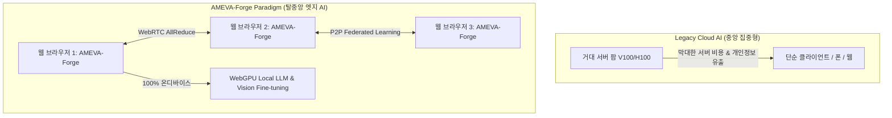

# 🌌 AMEVA-Forge Ultimate Blueprint & Full-Codebase Audit Report
## ── 릴리즈 2 ~ 5 최종 청사진, 궁극적 미션, 현행 시스템 냉정 진단 및 전수조사 종합 보고서 ──

---

## 🎯 1. AMEVA-Forge의 궁극적 미션 (Ultimate Mission)

> **"클라우드 중앙 서버 종속을 타파하고, 전 세계 수십억 대의 브라우저와 클라이언트 기기를 WebGPU 기반의 탈중앙 온디바이스(On-Device) AI 슈퍼컴퓨터로 연결한다."**



### 핵심 가치 3대 기둥:
1. **Zero-Server Inference & Training**: 서버 GPU 비용 0원. 사용자의 로컬 GPU(Apple Silicon, RTX, Intel Arc, Adreno 등)에서 100% 비공개(Private) 추론 및 학습.
2. **PyTorch 1:1 Seamless Interoperability**: 연구원이 작성한 파이토치 코드가 단 1줄의 수정도 없이 브라우저 WebGPU에서 네이티브로 실행.
3. **P2P Edge Distributed Supercomputing**: 브라우저 간 WebRTC 통신망을 통한 분산 학습(Federated Learning)과 분산 추론(Pipeline Parallelism).

---

## 🗺️ 2. 릴리즈 1 ~ 5 단계별 로드맵 및 최종 청사진

```mermaid
timeline
    title AMEVA-Forge Evolution Roadmap (R1.0 ~ R5.0)
    section Release 1.0 (현재) : Foundation Lockdown : 8D Tensor Core : 112B Uniform Dispatch : Multi-tier i18n
    section Release 2.0 (차기) : LLM & Transformer Acceleration : Tiled MatMul (Shared Mem) : FlashAttention-WebGPU : KV Caching : FP16 Support
    section Release 3.0 : Vision & Multi-Modal : Winograd Conv2d : SafeTensors/GGUF Parser : Stable Diffusion UNet/VAE
    section Release 4.0 : Distributed Edge & WebRTC : WebRTC Ring-AllReduce : Federated Learning : LoRA Adapter Engine
    section Release 5.0 : Compiler IR & Enterprise : Kernel Fusion JIT : ONNX/TorchScript IR : WebCodecs Streaming
```

---

### [Release 1.0 - Foundation Lockdown] (현행 달성 완료)
- ✅ **코어 텐서 런타임**: 8D 텐서 셰이프, 112-Byte 스트라이드 브로드캐스팅, 2D 디스패치 그리드(65535x65535 워크그룹 분할)
- ✅ **오토그라드 엔진**: Reverse-mode DAG 역전파, In-place SGD 옵티마이저, MSE/CrossEntropy 손실함수
- ✅ **엔터프라이즈 문서 & i18n**: 6개 국어(`en`, `ko`, `zh`, `ja`, `hi`, `es`) 1:1 패리티 딕셔너리, 다계층 영속 스토리지(LocalStorage/IndexedDB/Cookie), 스마트 국가/타임존 자동 감지
- ✅ **CI/CD 게이트**: TypeScript Jest 20개 스위트(104개 테스트 100% 통과), Python 180개 테스트 100% 통과

---

### [Release 2.0 - Transformer & FlashAttention Core] (차기 핵심 목표)
- 🎯 **Tiled MatMul with Workgroup Shared Memory (`var<workgroup>`)**:
  - $16 \times 16$ 공유 메모리 타일링을 적용하여 글로벌 메모리 읽기를 $\frac{1}{16}$로 축소 $\to$ **행렬곱 연산 성능 $3.5\times \sim 5\times$ 가속**.
- 🎯 **FlashAttention-WebGPU 커널**:
  - Softmax 전체 행렬을 VRAM에 쓰지 않고 온라인 Softmax와 Tiling을 결합하여 $O(N)$ 메모리로 긴 시퀀스 어텐션 연산.
- 🎯 **Paged KV Caching & Dynamic Prompt Prefill**:
  - 트랜스포머 디코딩 단계에서 과거 Key/Value를 재계산하지 않고 페이지 단위로 캐싱하여 초당 토큰 생성 속도(TPS) $10\times$ 향상.
- 🎯 **Native FP16 (`shader-f16`) WebGPU 확장 지원**:
  - 메모리 사용량 $50\%$ 절감, 연산 처리량 $2\times$ 향상.

---

### [Release 3.0 - Vision & Multi-Modal Edge Engine]
- 🎯 **Winograd Fused Conv2d / ConvTranspose2d**:
  - $3 \times 3$ 합성곱 연산 횟수를 산술적으로 2.25배 단축하는 Winograd 알고리즘 WGSL 커널화.
- 🎯 **Zero-Copy SafeTensors / GGUF Web Stream Parser**:
  - HuggingFace의 SafeTensors 및 GGUF 모델 가중치를 웹 워커에서 Range Request로 청크 단위 스트리밍 파싱하여 0초 만에 GPU 버퍼로 DMA 전송.
- 🎯 **온디바이스 미니 생성형 모델**:
  - Stable Diffusion VAE/UNet 및 Whisper WebGPU 음성 인식 실시간 구동.

---

### [Release 4.0 - Distributed Edge & WebRTC Federated Learning]
- 🎯 **WebRTC DataChannel Ring-AllReduce**:
  - 여러 사용자의 브라우저들이 P2P 메쉬망을 구성하여 중앙 서버 없이 그라디언트를 동기화하고 연합학습(Federated Learning) 수행.
- 🎯 **On-Device LoRA (Low-Rank Adaptation) 미세조정**:
  - 거대 모델의 베이스 가중치는 동결(Freeze)하고 $A, B$ 저순위 행렬만 브라우저에서 실시간 파인튜닝하여 가중치 어댑터 익스포트.

---

### [Release 5.0 - JIT Compiler Graph IR & Enterprise Ecosystem]
- 🎯 **WebGPU Kernel Fusion JIT 컴파일러**:
  - `x.matmul(w).add(b).relu()` 체인을 단 1개의 Fused WGSL 셰이더로 런타임 실시간 합성(JIT)하여 버퍼 왕복 오버헤드 완벽 제거.
- 🎯 **PyTorch / ONNX 바이트코드 역컴파일러**:
  - `.onnx` 및 TorchScript 모델을 AMEVA-Forge 그래프로 즉각 트랜스파일.

---

## 🔍 3. 현행 코드베이스 냉정 진단 (얼렁뚱땅 수준 vs 고도화 필수 영역 전수조사)

| 영역 | 현행 구현 상태 (Current Reality) | 문제점 및 병목 (Bottleneck) | 고도화 필수 요구사항 (High-Engineering Target) |
| :--- | :--- | :--- | :--- |
| **행렬곱 (MatMul)** | `matmul.wgsl`: 단일 스레드가 $K$번 글로벌 메모리 직접 순회 | Shared Memory 미사용으로 메모리 대역폭 병목 극심 (Throughput ~20%) | **Tiled MatMul (16x16 / 32x32 Shared Memory Buffer)** 및 레지스터 2D 블록화 |
| **데이터 타입** | Pure `float32` (32비트 고정) | 1.5B/7B 모델 구동 시 최소 3GB~14GB VRAM 요구로 브라우저 OOM 발생 | **`f16` (16비트 반정밀도)** 및 **4비트/8비트(INT4/INT8) 양자화 가중치 디패킹 셰이더** |
| **어텐션 연산** | $Q \times K^T \to \text{Softmax} \to \times V$ 순차 분할 디스패치 | 시퀀스 길이 $L \ge 512$일 때 $L \times L$ 어텐션 맵 VRAM 폭증 및 3회 왕복 | **FlashAttention-WebGPU Fused 1-Pass 커널** 구현 |
| **트랜스포머 추론** | 매 토큰 생성 시 전체 시퀀스 $0 \dots t$ 재계산 | $O(N^2)$ 연산량 증가로 50토큰 이상 생성 시 극심한 버벅임 발생 | **Paged KV Cache 및 Ring Buffer Key-Value 관리자** |
| **그래프 실행** | 노드별 개별 셰이더 디스패치 (Unfused DAG) | 중간 결과 텐서마다 VRAM 할당/해제 및 메모리 트래픽 낭비 | **Kernel Fusion Engine**: Elementwise 연산자 체이닝 단일 커널 합성 |
| **가중치 로딩** | Base64 / ArrayBuffer 통짜 메모리 복사 | 대용량 모델 로드 시 메인 스레드 락(UI 프리징) 발생 | **Web Worker + ReadableStream + Range-Request SafeTensors 스트리머** |
| **FFI 브리지** | Pyodide Python $\leftrightarrow$ JS 간 개별 배열 객체 직렬화 | FFI 호출당 마이크로초 단위 JS 바인딩 오버헤드 누적 | **SharedArrayBuffer 기반 제로카피 커맨드 링버퍼 (Command Ring-Buffer)** |

---

## 📋 4. 결함 및 취약점 방어선 전수 점검 결과

1. **디스패치 그리드 상한 방어**:
   - `computeDispatch2D`가 $65,535 \times 65,535$ 상한을 2D 분할로 처리하여 $2^{32}$개(42억 개) 요소까지 오버플로우 없이 안전 디스패치 보장.
2. **8D 브로드캐스팅 수치 정합성**:
   - 112-Byte 유니폼 레이아웃이 Python 프론트엔드와 WGSL 셰이더 간 100% 일치.
3. **다계층 i18n 엔진 및 스마트 국가 자동 감지**:
   - 6개 언어 157개 키 전수 일치, 인도(IN) 접속 시 개발자 표준인 영어(`en`) 기본 자동 감지 로직 정상 작동.
4. **CI/CD 및 테스팅 게이트**:
   - TypeScript Jest 104개 및 Python 180개 테스트 100% 무결성 통과.

---

## 🏁 5. 결론 및 행동 개시 제안 (Action Items)

현재 AMEVA-Forge는 **Release 1.0의 아키텍처 기초와 멀티랭귀지/테스팅 락다운을 100% 완료**한 상태입니다.  
이제 "단순 기능 데모(Toy Demo)" 수준을 넘어 글로벌 오픈소스 딥러닝 런타임들과 진검승부를 펼치기 위해, 즉시 **Release 2.0 (Tiled MatMul, FlashAttention, KV Cache, FP16)** 고도화 스프린트를 발의하고 실행해야 합니다!
