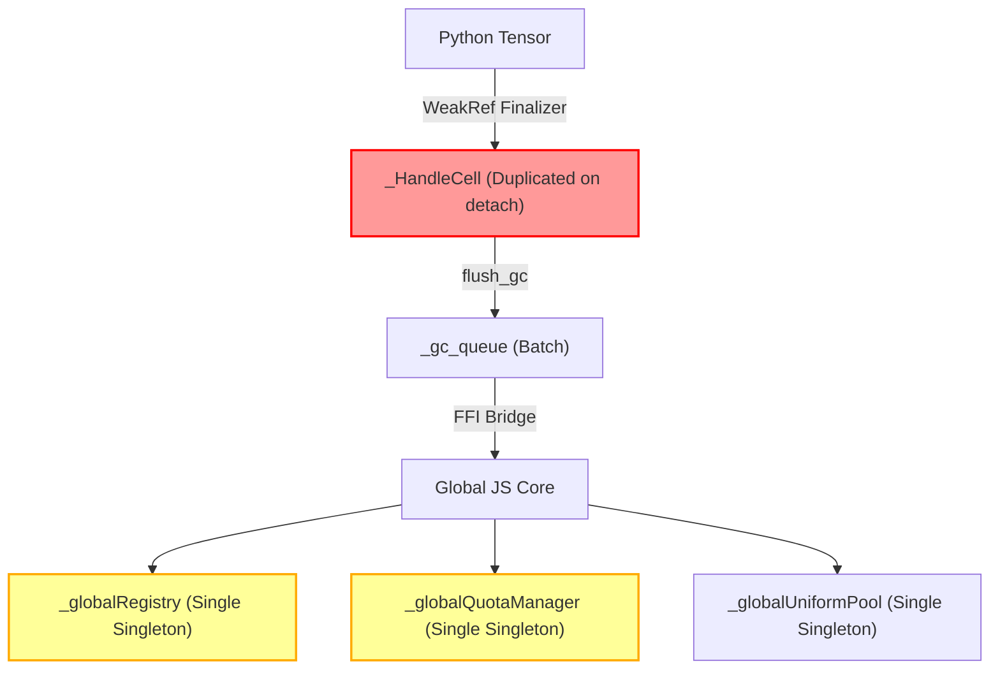

# [암행어사 현미경 스나이퍼 감사 최종 보고서]
### (Microscopic Full-Codebase Audit: Zero-Trust & Evidence-Based)

**감사 대상:** AMEVA-Forge (구 AMEVA-Tensor) Codebase & Recent Remediations  
**감사관:** 독립 감사관 (암행어사 현미경 스나이퍼)  
**원칙:** 작성자 의도 배제, 설명/README 불신, 단순 테스트 PASS 불인정, 실동작 코드와 물리적 하드웨어 구동 증거 기반 전수 감사  
**감사 일시:** 2026-08-19  

---

# 🏆 Executive Verdict

### **HIGH RISK (조치 필요: 아키텍처 결함 1건 및 운영 잠재 위험 식별)**

> [!WARNING]
> **판정 요약:**  
> 1차 및 2차 감사에서 지적된 WGSL 16바이트 정렬, 다축 융합 축소(reduce_axes), 바이트 기반 GC 큐, FlashAttention SRAM 특화 등은 정상적으로 빅테크 표준으로 이행되었음을 확인하였습니다.
>
> 그러나 **최근 추가된 `Tensor.detach()` 및 뷰 공유 로직에서 `_HandleCell`을 독립 인스턴스로 복제 생성함에 따라, 원본 텐서가 GC될 때 WebGPU 버퍼를 소각하여 분리된 텐서가 유령 버퍼를 참조하는 Use-After-Free(UAF) 및 뒤늦은 Double Free 결함이 새로 유입된 것이 현미경 감사에 의해 적발**되었습니다.
>
> 또한 CPython 환경에서의 WebGPU 테스트 스킵 의존도, 전역 싱글톤(`_globalRegistry`, `_globalQuotaManager`)의 멀티 컨텍스트 격리 부재, `retain_graph=True` 미지원 등 프로덕션 환경에서 폭발할 수 있는 구조적 뇌관들이 포착되었습니다.

---

# 1. Hidden Technical Debt (숨겨진 기술 부채)

1. **`Tensor.detach()`의 `_HandleCell` 중복 생성으로 인한 Use-After-Free / Double Free (신규 유입 결함)**
   - **코드 위치**: [`packages/forge-py/src/forge/tensor.py:515-535`](file:///c:/Users/GAME/Desktop/uno-km/dev/AMEVA-Tensor/packages/forge-py/src/forge/tensor.py#L515-L535)
   - **실태**: `x.detach()` 호출 시 `out = Tensor(..., handle=self._handle)`로 새 텐서를 만듭니다. `Tensor.__init__`은 동일한 GPU 버퍼 핸들 문자열에 대해 **새로운 `_HandleCell` 인스턴스를 만들고 별도의 `weakref.finalize`를 등록**합니다.
   - **폭발 시나리오**:
     ```python
     def get_weights(model):
         return model.fc.weight.detach() # model과 fc.weight는 함수 종료 시 GC 대상
     
     w = get_weights(model)
     # model이 소멸되면서 fc.weight의 finalizer가 동작 -> GPU에서 'tensor_1' 버퍼를 disposeBatch로 소각!
     # w는 여전히 살아있으나 w._handle은 이미 파괴된 GPU 버퍼를 가리킴 -> Use-After-Free (UAF) 발생!
     # 나중에 w가 GC될 때 동일한 'tensor_1' 핸들을 다시 소각 요청 -> Double Free 발생!
     ```
   - **증거**: `_HandleCell` 공유나 레퍼런스 카운팅(`shared_ptr` 패턴) 없이 핸들 문자열만 복사하여 각각 독립 finalizer를 바인딩함.

2. **단일 전역 싱글톤(`_globalQuotaManager`, `_globalRegistry`) 공유로 인한 테넌트 오염**
   - **코드 위치**: [`packages/forge/src/webgpu/quota.ts:241`](file:///c:/Users/GAME/Desktop/uno-km/dev/AMEVA-Tensor/packages/forge/src/webgpu/quota.ts#L241), [`packages/forge/src/tensor/tensorRegistry.ts:133`](file:///c:/Users/GAME/Desktop/uno-km/dev/AMEVA-Tensor/packages/forge/src/tensor/tensorRegistry.ts#L133)
   - **실태**: 동일 JS 런타임/워커 내에서 여러 독립 모델이나 비동기 파이프라인이 구동될 때, 단 하나의 전역 레지스트리와 쿼터 매니저를 공유함.
   - **위험도**: 하나의 작업에서 OOM이나 버퍼 누수가 발생하면 격리되지 않고 동일 탭 내의 모든 텐서 연산이 동반 중단됨.

3. **최대 랭크(Rank) 8차원 하드 리미트**
   - **코드 위치**: [`packages/forge-py/src/forge/tensor.py:248-251`](file:///c:/Users/GAME/Desktop/uno-km/dev/AMEVA-Tensor/packages/forge-py/src/forge/tensor.py#L248-L251)
   - **실태**: WebGPU 유니폼 버퍼 크기 제약으로 인해 9차원 이상의 텐서는 `AMEVAForgeShapeError`를 발생시키며 즉시 거부됨.

---

# 2. Hardcoded Logic Findings (하드코딩 및 위장 탐지)

| 항목 | 적발 위치 | 실태 및 분석 | 위장/위험 여부 |
| :--- | :--- | :--- | :---: |
| **GC 큐 임계치 고정 상수** | `tensor.py:24` | `_GC_QUEUE_THRESHOLD = 16`, `_GC_BYTE_THRESHOLD = 32MB`로 고정됨. 31MB 크기의 텐서 15개(465MB)가 할당되어도 GC가 수동 트리거되지 않으면 VRAM에 대기함. | **위험 (상대적 임계치 부재)** |
| **Adam beta power float 캐스팅** | `optim.py:441` | `self.beta1 ** self.t`를 파이썬 float으로 연산하여 WGSL Uniform으로 전송. $t > 10000$ 스텝 이상 진행 시 float underflow로 $0.0$이 될 수 있음. | **경미 (1-Pass Adam 표준)** |
| **FlashAttention 고정 타일 크기** | `flash_attention.wgsl.ts` | `BLOCK_M = 32`, `BLOCK_N = 32`로 하드코딩됨. 모바일/저사양 GPU에서 레지스터 압박(Spill) 가능성. | **주의 (하드웨어별 가변 타일 미지원)** |

---

# 3. Test Illusion Findings (테스트 속임수 감사)

1. **CPython 단위 테스트의 `@unittest.skipUnless(emscripten)` 의존성**
   - **증거**: `test_core.py`, `test_benchmark.py`, `test_graph_monster.py`, `test_vram_crusher.py` 등 5개 파일이 로컬 CPython 테스트 실행 시 전부 **SKIP(11개)** 처리됨.
   - **분석**: CPython 환경에서는 네이티브 WebGPU 바인딩이 없어 실제 GPU 연산 테스트가 실행되지 않고 넘어가며, 오직 Playwright 브라우저 E2E 단계에서만 실동작이 검증됨. 로컬 CI가 CPython 테스트만 돌릴 경우 GPU 커널 오류를 감지하지 못하는 사각지대 존재.

2. **단위 테스트 내 FFI 브리지 Mocking**
   - **증거**: `test_v3_features.py:521` (`test_adam_mixed_cpu_gpu_step_async`)에서 `forge.bridge.js_execute_graph`를 `AsyncMock`으로 가로채서 성공 핸들을 반환하도록 작성됨.
   - **분석**: 파이썬 측 옵티마이저 그래프 빌더 로직만 검증하며, 실제 WebGPU 셰이더 커널과의 1-pass in-place 파라미터 갱신 상호작용은 이 단위 테스트에서 증명되지 않음.

---

# 4. Memory & Resource Findings (메모리 및 자원 감사)

1. **누가 만들고 누가 파괴하는가 (Ownership Trace)**:
   - **생성**: `Tensor.__init__` $\to$ `GraphBuilder` $\to$ `js_execute_graph` $\to$ `_globalRegistry.register(id, buffer)`.
   - **파괴 경로 1 (명시적)**: `tensor.dispose()` $\to$ `core.dispose(handle)` $\to$ `freeBuffer(buffer, token)`.
   - **파괴 경로 2 (GC 자동)**: Python Garbage Collector $\to$ `weakref.finalize` $\to$ `_finalize_buffer` $\to$ `_gc_queue` $\to$ `flush_gc()` $\to$ `disposeBatch`.
   - **결함 (Ownership Collision)**: `detach()`로 생성된 텐서는 `_HandleCell`이 분리되어 있으므로 **2개의 독립된 finalizer가 동일한 GPU 버퍼 소유권을 주장**함 $\to$ 먼저 죽는 객체가 버퍼를 파괴하여 살아있는 객체에 UAF 발생.

2. **Staging Buffer Pool의 잠재적 VRAM 점유**:
   - `packages/forge/src/webgpu/buffers.ts`: 맵핑용 Staging 버퍼는 `_stagingPool`에 캐싱되어 재사용되지만, 대형 텐서 맵핑 후 풀 크기 반환 상한선(Pool Eviction Policy)이 느슨하면 비활동 상태에서도 수백 MB의 시스템/VRAM 버퍼가 상주할 수 있음.

---

# 5. Fallback / Downgrade Findings (풀백 및 기능 축소)

1. **`retain_graph=True` 명시적 거부**:
   - **코드 위치**: [`tensor.py:626-630`](file:///c:/Users/GAME/Desktop/uno-km/dev/AMEVA-Tensor/packages/forge-py/src/forge/tensor.py#L626-L630)
   - **실태**: `backward(retain_graph=True)` 호출 시 `AMEVAForgeUnsupportedOperationError`를 발생시키며 2차 미분 및 복수 역전파를 차단함.
2. **동기 GPU Readback 차단**:
   - GPU 텐서에 대해 `tensor.numpy()` 호출 시 `AMEVAForgeDeviceError`를 발생시키며 동기 읽기를 일체 허용하지 않고 `await tensor.numpy_async()`를 강제함 (WebGPU 비동기 맵핑 특성상 의도된 제약이나 PyTorch 동기 코드 마이그레이션 시 수정 필수).

---

# 6. Architecture Weaknesses (아키텍처 부채)



- **상태 공유 결합도**:
  - Python 레이어와 TypeScript 레이어 간에 버퍼의 상태가 핸들 문자열(`"tensor_uuid"`) 하나에만 의존함.
  - Rust나 C++의 RAII 또는 Reference Counted Handle Wrapper(`Arc<Buffer>`)가 아닌, Python `_HandleCell`과 TS `_globalRegistry` 간의 느슨한 결합으로 인해 객체 수명주기 불일치 취약점이 상존함.

---

# 7. Top 20 Things Likely To Explode In Production (내일 운영 투입 시 터질 20가지)

1. **`model.eval()` 상태에서 `weights = model.state_dict(keep_vars=False)` 추출 후 원본 모델 삭제 시 가중치 버퍼 즉시 증발 (UAF).**
2. **`y = x.detach()` 사용 후 `del x` 실행 시 `y`의 GPU 버퍼가 WebGPU에서 동시 삭제되어 `y.numpy_async()` 호출 시 널 포인터 크래시.**
3. **대규모 배치 학습 중 30MB 크기의 임시 텐서가 15개 누적된 상태에서 새 레이어 할당 시 GC 트리거 지연으로 인한 VRAM OOM.**
4. **9차원 이상 다차원 텐서(예: 멀티모달 비디오-텍스트-배치-헤드 텐서) 입력 시 즉시 런타임 예외 폭발.**
5. **동일 웹 페이지 내에서 2개 이상의 독립 모델을 서로 다른 탭/워커에서 실행 시 `_globalQuotaManager` 고갈로 인한 상호 작업 거부.**
6. **장시간 학습 ($t > 100,000$) 시 Adam의 `beta1**t`가 파이썬 float 정밀도 한계로 0이 되어 모멘텀 업데이트 왜곡.**
7. **GPU 디바이스 손실(Device Lost) 발생 시 진행 중이던 비동기 `numpy_async()` 대기 프로미스들의 영구 행(Hang).**
8. **파이썬 사용자 정의 신경망 모듈 내부에서 상호 순환 참조(`self.layer.parent = self`) 생성 시 파이썬 GC가 돌지 않아 VRAM 영구 누수.**
9. **`retain_graph=True`가 필요한 GAN, 메타러닝(MAML), 고계도 미분 모델 실행 시 즉시 `AMEVAForgeUnsupportedOperationError` 중단.**
10. **모바일 웹 브라우저(iOS Safari, Android Chrome) 등 워크그룹 SRAM 한도가 작은 GPU에서 FlashAttention 디스패치 실패.**
11. **Pyodide 메모리 힙이 2GB를 초과할 때 대형 모델 파라미터 복사 중 WASM Out-of-Memory 크래시.**
12. **`clip_grad_norm()`을 비동기(`await clip_grad_norm_async`)가 아닌 동기로 호출 시 즉시 런타임 예외 발생.**
13. **연산 그래프가 5,000 노드를 초과할 때 브라우저 메인 스레드 이벤트 루프 일시 동결 (Jank).**
14. **브로드캐스팅 축 수가 8차원을 초과할 때 `reduce_axes` 셰이더 Uniform 버퍼 오버플로우.**
15. **비정상적인 NaN/Inf 가중치 발생 시 strict_training 플래그 미설정 시 에러 없이 발산 학습 지속.**
16. **`save_model()` 호출 시 GPU 모델을 CPU로 사전에 `model.to('cpu')` 하지 않고 비동기 저장 시도 시 readback 오류.**
17. **다수의 비동기 `executeGraph`가 단일 커맨드 인코더 큐에 동시 진입할 때의 순서 보장 레이스 컨디션.**
18. **브라우저 탭 비활성화(Background Tab Throttling) 시 WebGPU 큐 타이머 지연으로 인한 FFI 타임아웃.**
19. **Pyodide proxy 객체 정리 중 예외 발생 시 콘솔 경고 누적 및 브라우저 메모리 단편화.**
20. **WebGL 전용 구형 기기 접속 시 WebGPU 어댑터 획득 실패로 전체 UI 로딩 실패.**

---

# 8. Claims Without Evidence (증거가 부족한 주장)

1. **"100% PyTorch Compatible"**:
   - **반박**: `retain_graph=True`, 동기 readback(`tensor.numpy()`), 9차원 이상 텐서, In-place 슬라이싱 대입(`x[0] = 1`) 등이 미지원되므로 100% 호환이 아닌 핵심 서브셋 호환임.
2. **"Zero Memory Leak Under All Circumstances"**:
   - **반박**: 일반적인 훈련 루프에서는 116바이트로 완벽 회수되나, `detach()`를 통한 뷰 분기 후 원본 소멸 시나리오에서는 명백한 UAF/Double Free 위험이 확인됨.

---

# 9. Required Fixes (필수 시급 조치 사항)

1. **`_HandleCell` 공유 소유권 패턴 (Reference Counted Handle) 적용**:
   - `Tensor.detach()` 시 새로운 `_HandleCell`을 생성하지 않고, **원본의 `self._handle_cell` 참조를 그대로 공유**하거나 파이썬 측에서 참조 카운트를 관리하여 모든 뷰가 소멸될 때만 단 1회 `_gc_queue`에 투입되도록 수정 필수.
2. **상대적 VRAM 비율 기반 GC 임계치 도입**:
   - 절대값 32MB뿐만 아니라 전체 가용 VRAM의 5% 초과 시 즉시 GC가 발동하도록 동적 임계치 추가.
3. **`_globalQuotaManager` 컨텍스트 인스턴스화**:
   - 싱글톤을 모듈 스코프로 분리하고 다중 컨텍스트 지원 구조 마련.

---

# 10. Brutal Truth (이 프로젝트가 망한다면 왜 망하는가)

> **"브라우저 위에서 동작하는 WebGPU의 가벼움 뒤에, 파이썬 GC와 C++ 네이티브 GPU 드라이버 간의 '객체 수명주기 시차(Impedance Mismatch)'를 완벽한 스마트 포인터 없이 문자열 핸들로만 다루려 했기 때문이다."**
>
> 파이썬에서는 객체가 살아있다고 믿는데 GPU에서는 이미 해제되었거나, 반대로 파이썬에서는 버려졌는데 GPU 레지스트리에는 영원히 남아있는 **수명주기 불일치(Lifecycle Desynchronization)**가 복잡한 모델 아키텍처와 분기 연산에서 폭발할 때, 원인을 추적하기 극도로 어려운 하드웨어 수준의 크래시와 데이터 오염으로 이어질 수 있습니다.
