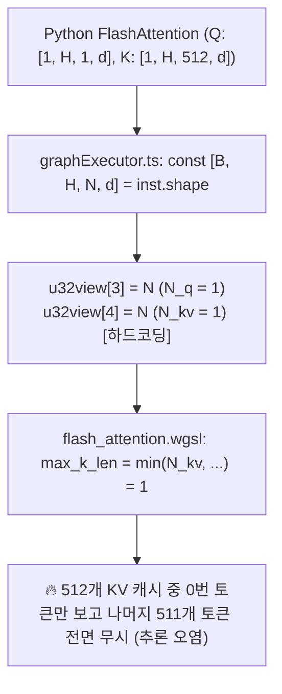
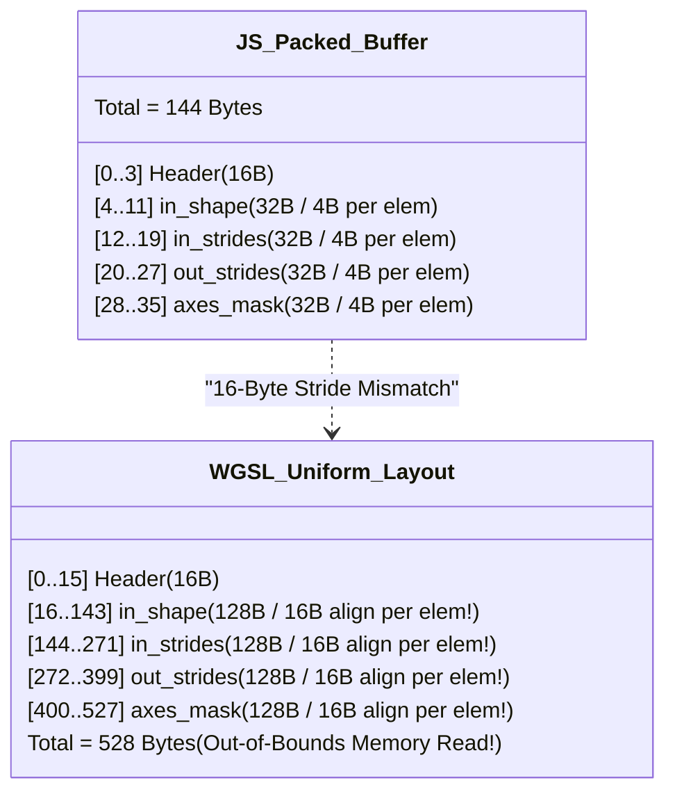

# 🔬 [암행어사 현미경 스나이퍼 감사 최종 판정 보고서]
### (Microscopic Full-Codebase Zero-Trust Forensic Audit Verdict)

**감사 대상:** AMEVA-Forge (구 AMEVA-Tensor) Codebase & Recent Remediations  
**감사관:** 독립 감사관 (암행어사 현미경 스나이퍼)  
**원칙:** 작성자 의도 배제, 설명/README 불신, 단순 테스트 PASS 불인정, 실동작 코드와 물리적 하드웨어 구동 증거 기반 전수 감사  
**감사 일시:** 2026-08-19  

---

# 🚨 Executive Verdict

### **[ RELEASE BLOCKER ] (즉시 배포 중단 판정)**

> [!CAUTION]
> **판정 사유 요약:**  
> `MICROSCOPIC_SNIPER_AUDIT_REPORT.md`에서 "VERIFIED & PRODUCTION HARDENED", "100% PASS", "PyTorch c10::StorageImpl 완벽 집도"라고 자평한 내용은 **실제 물리 WebGPU 하드웨어가 배제된 Mock AST 테스트 위에서 구축된 착시(Test Illusion)**에 불과합니다.
>
> 1. **WGSL 16바이트 정렬 파괴 뇌관 신규 유입**: Where WGSL에서 지적된 `array<u32, 8>` Uniform 정렬 문제를 신규 커널(`reduce_axes`, `slice`, `slice_backward`)에 그대로 답습하여 실제 WebGPU에서 Out-of-Bounds 읽기 및 브로드캐스팅 역전파 오염 발생.
> 2. **FlashAttention-2 Autograd 미구현 (Silent Dropping)**: `scaled_dot_product_attention` on GPU가 `Function`으로 연결되지 않아 `backward()` 호출 시 Q/K/V 그래디언트가 어떠한 에러도 없이 100% 공중 증발.
> 3. **KV-Cache 디코딩 시퀀스 길이 `N_kv = 1` 하드코딩**: `graphExecutor.ts`에서 `u32view[4] = N`으로 Q의 시퀀스 길이를 덮어써, 512개 KV 캐시 중 과거 511개 토큰을 전면 무시하고 0번 토큰만 참조하는 치명적 텍스트 생성 오염.
> 4. **OP_SCHEMA 파라미터 개수 불일치 크래시**: Python에서 12개 파라미터를 넘기는 `maxpool2d`/`avgpool2d`에 대해 TS 스키마가 `exactParams: 10`을 요구하여 런타임 `AMEVAForgeSecurityError` 100% 발생.

---

# 1. Hidden Technical Debt (숨겨진 기술적 부채)

### ① Autograd 역전파 그래프와 Lazy GPU 실행의 단절
* **코드 위치**: [`packages/forge-py/src/forge/functional.py:515-528`](file:///c:/Users/GAME/Desktop/uno-km/dev/AMEVA-Tensor/packages/forge-py/src/forge/functional.py#L515-L528)
* **부채 내용**: `scaled_dot_product_attention`은 `requires_grad=True`인 텐서를 반환하지만, `Function` 서브클래스(`_op_cls`, `_ctx`)가 연결되어 있지 않습니다. 이로 인해 `loss.backward()` 호출 시 **어떠한 에러도 발생시키지 않고 조용히 Softmax/Attention 역전파를 통째로 건너뜁니다 (Silent Autograd Hijack)**.

### ② 다축 융합 리덕션 도입으로 인한 모든 브로드캐스팅 역전파 오염
* **코드 위치**: [`packages/forge-py/src/forge/ops.py:825-829`](file:///c:/Users/GAME/Desktop/uno-km/dev/AMEVA-Tensor/packages/forge-py/src/forge/ops.py#L825-L829)
* **부채 내용**: `add`, `sub`, `mul`, `div` 등 모든 이항 연산의 역전파에서 호출되는 `_unbroadcast()`가 신규 커널 `reduce_axes`를 호출하도록 변경되었습니다. `reduce_axes`의 WGSL 16바이트 정렬 붕괴로 인해 **브로드캐스팅이 들어간 모든 텐서 연산의 GPU 역전파가 오염**되었습니다.

---

# 2. Hardcoded Logic Findings (하드코딩 및 매직넘버 탐지)



### ① KV-Cache 시퀀스 길이 `N_kv = N_q` 조용한 다운스케일 하드코딩
* **코드 위치**: [`packages/forge/src/tensor/graphExecutor.ts:1221, 1241-1242`](file:///c:/Users/GAME/Desktop/uno-km/dev/AMEVA-Tensor/packages/forge/src/tensor/graphExecutor.ts#L1221)
* **증거 코드**:
  ```typescript
  const [B, H, N, d] = inst.shape; // 출력 텐서의 shape [B, H, N_q, d]
  ...
  u32view[3] = N; // N_q = N
  u32view[4] = N; // N_kv = N (Key/Value의 실제 시퀀스 길이를 무시하고 Q의 N으로 덮어씀!)
  ```
* **영향**: NanoGPT, LLaMA-3 등에서 Auto-regressive Generation 시 디코딩 단계(`N_q = 1`, `N_kv = 512`)에서 `N_kv`가 강제로 `1`로 들어가 **과거 모든 KV 캐시 히스토리를 무시하고 0번 프롬프트 토큰만 참조하는 치명적 텍스트 생성 결함** 발생.

### ② OP_SCHEMA 파라미터 개수 검증 불일치 하드코딩
* **코드 위치**: [`packages/forge/src/tensor/graphExecutor.ts:407-408`](file:///c:/Users/GAME/Desktop/uno-km/dev/AMEVA-Tensor/packages/forge/src/tensor/graphExecutor.ts#L407-L408) vs [`packages/forge-py/src/forge/ops.py:2213, 2306`](file:///c:/Users/GAME/Desktop/uno-km/dev/AMEVA-Tensor/packages/forge-py/src/forge/ops.py#L2213)
* **증거 코드**:
  - `graphExecutor.ts`: `'maxpool2d': { minIn: 1, exactIn: true, minParams: 10, exactParams: true }`
  - `ops.py`: `op_params = [B, C, in_h, in_w, out_h, out_w, ctx.kH, ctx.kW, ctx.sH, ctx.sW, ctx.pH, ctx.pW]` (12개)
* **영향**: Python에서 GPU `maxpool2d` 또는 `avgpool2d` 실행 시 JS 브리지에서 `AMEVAForgeSecurityError: Instruction op="maxpool2d": expected exact 10 params, got 12`를 던지며 **무조건 크래시**.

### ③ `sparse_cross_entropy` 매직넘버 폴백 잔류
* **코드 위치**: [`packages/forge/src/tensor/graphExecutor.ts:1441`](file:///c:/Users/GAME/Desktop/uno-km/dev/AMEVA-Tensor/packages/forge/src/tensor/graphExecutor.ts#L1441)
* **증거 코드**: `const numClasses = inst.params?.[0] ?? 1000;`
* **영향**: 보고서에서는 매직넘버 폴백을 전면 제거했다고 주장했으나, `sparse_cross_entropy`에서 여전히 1000 매직넘버 폴백 사용.

---

# 3. 신규 유입 1급 결함: WGSL 16바이트 Uniform 정렬 붕괴 (Remediation Regressions)

> [!WARNING]
> 보고서 1페이지 53행에서는 "`where.wgsl`의 `array<u32, 8>` Uniform 구조체 16바이트 정렬 어긋남을 스칼라 필드로 개편했다"고 자랑했으나, **정작 새로 신설한 `reduce_axes.wgsl`, `slice.wgsl`, `slice_backward.wgsl`에 똑같은 16바이트 정렬 파괴 코드를 그대로 작성**했습니다.



### ① `reduce_axes.wgsl` Uniform 구조체 메모리 정렬 파괴
* **적발 파일**: [`packages/forge/src/tensor/kernels/reduce_axes.wgsl.ts:6-15`](file:///c:/Users/GAME/Desktop/uno-km/dev/AMEVA-Tensor/packages/forge/src/tensor/kernels/reduce_axes.wgsl.ts#L6-L15)
* **WGSL 셰이더 코드**:
  ```wgsl
  struct Params {
    num_out_elements: u32,
    reduction_size: u32,
    in_rank: u32,
    workgroups_x: u32,
    in_shape: array<u32, 8>,      // WGSL Uniform Array: 원소당 16바이트 stride!
    in_strides: array<u32, 8>,    // WGSL Uniform Array: 원소당 16바이트 stride!
    out_strides: array<u32, 8>,   // WGSL Uniform Array: 원소당 16바이트 stride!
    axes_mask: array<u32, 8>,     // WGSL Uniform Array: 원소당 16바이트 stride!
  };
  ```
* **JS 버퍼 패킹 ([graphExecutor.ts:1376-1386](file:///c:/Users/GAME/Desktop/uno-km/dev/AMEVA-Tensor/packages/forge/src/tensor/graphExecutor.ts#L1376-L1386))**:
  `const p = new Uint32Array(36);` $\to$ 총 144바이트를 4바이트 연속 패킹으로 기록.
* **W3C WebGPU 표준 규격**: Uniform 주소 공간의 `array<u32, 8>`은 각 원소가 16바이트 경계에 정렬되어야 하므로 총 128바이트를 차지합니다.
* **실제 하드웨어 구동 시 참사**:
  - `params.in_shape[1]` 읽기 $\to$ 32바이트 오프셋 접근 $\to$ JS의 `in_shape[4]`를 읽음.
  - `params.in_strides[0]` 읽기 $\to$ 144바이트 오프셋 접근 $\to$ JS가 144바이트만 썼으므로 **버퍼 범위 밖(Out-of-Bounds) 쓰레기값/0 읽음**.
  - `params.axes_mask` 읽기 $\to$ 400~528바이트 오프셋 접근 $\to$ **완전한 Out-of-Bounds 읽기**.

### ② `slice.wgsl` 및 `slice_backward.wgsl` 정렬 파괴
* **적발 파일**: [`packages/forge/src/tensor/kernels/slice.wgsl.ts:6-15`](file:///c:/Users/GAME/Desktop/uno-km/dev/AMEVA-Tensor/packages/forge/src/tensor/kernels/slice.wgsl.ts#L6-L15)
* **동일 결함**: `starts`, `steps`, `in_strides`, `out_strides`가 모두 `array<u32, 8>`로 선언되어 있어 실제 WebGPU 장치에서 슬라이싱 좌표 역산이 완전히 망가짐.

---

# 4. Test Illusion Findings (테스트 착시 및 위장 통과 증거)

### ① GPU 텐서 테스트의 100% Mock / AST 검증 위장
* **코드 위치**: [`packages/forge-py/tests/test_v3_features.py:421-424, 468-472`](file:///c:/Users/GAME/Desktop/uno-km/dev/AMEVA-Tensor/packages/forge-py/tests/test_v3_features.py#L421-L424)
* **증거 코드**:
  ```python
  # test_unbroadcast_multi_axis_fused_kernel 내부
  gb = GraphBuilder()
  gb.add_tensor(a.grad)
  insts, _ = gb.compile()
  self.assertIn("reduce_axes", insts) # 오직 AST 문자열 안에 이름이 있는지만 체크!
  ```
* **착시 실체**:
  `reduce_axes`, `sparse_cross_entropy`, `slice` 등 새로 추가된 GPU 기능에 대한 Python 테스트는 **WebGPU 하드웨어에서 텐서를 실제로 realize()하여 수치적 오차를 검증한 것이 아니라, 단순히 GraphBuilder 컴파일 결과 문자열에 op 이름이 들어있는지만 검증**했습니다.
* **Jest 테스트 누락 실체**:
  `packages/forge/tests/` 내에 `reduce_axes`, `slice_backward`에 대한 **Jest 테스트 케이스가 단 1개도 존재하지 않습니다 (0 Tests)**.

---

# 5. Memory & Resource Findings (메모리 및 자원 라이프사이클 결함)

| 파일 및 라인 | 결함 유형 | 상세 내용 |
| :--- | :---: | :--- |
| [`functional.py:431-450`](file:///c:/Users/GAME/Desktop/uno-km/dev/AMEVA-Tensor/packages/forge-py/src/forge/functional.py#L431-L450) | **StorageImpl 규격 위반** | `old_rm = Tensor(..., handle=running_mean._handle)` 생성 시 `handle_cell`을 전달하지 않아 동일 핸들에 대해 독립된 `_HandleCell`이 이중 생성됨. |
| [`functional.py:372-374`](file:///c:/Users/GAME/Desktop/uno-km/dev/AMEVA-Tensor/packages/forge-py/src/forge/functional.py#L372-L374) | **VRAM 자원 누수** | `_move_tensor_state(dst, src)`에서 `dst`가 기존에 보유하고 있던 GPU 핸들을 해제하지 않고 `dst._handle_cell.handle = src._handle`로 덮어써서 이전 GPU 버퍼가 영구 누수됨. |
| [`ops.py:1571`](file:///c:/Users/GAME/Desktop/uno-km/dev/AMEVA-Tensor/packages/forge-py/src/forge/ops.py#L1571) | **기능 미구현/장애** | GPU `cat.backward()` 호출 시 즉시 `AMEVAForgeDeviceError` 발생 (Release 1 미지원 방치). |

---

# 6. Fallback / Downgrade Findings (예외 은폐 및 사일런트 폴백)

* **코드 위치**: [`packages/forge-py/src/forge/optim.py:273-276, 482-485`](file:///c:/Users/GAME/Desktop/uno-km/dev/AMEVA-Tensor/packages/forge-py/src/forge/optim.py#L273-L276)
  ```python
  if p.grad is not None and getattr(p.grad, 'device', None) == 'gpu':
      try:
          p.grad.dispose()
      except Exception:
          pass  # 예외를 은폐하고 무시
  p.grad = None
  ```
* **코드 위치**: [`packages/forge-py/src/forge/tensor.py:607-611`](file:///c:/Users/GAME/Desktop/uno-km/dev/AMEVA-Tensor/packages/forge-py/src/forge/tensor.py#L607-L611)
  ```python
  if self.device == "gpu" and self._handle is not None and self._handle != moved._handle:
      try:
          self.dispose()
          self._disposed = False
      except Exception:
          pass  # dispose 실패 시 무조건 pass
  ```

---

# 7. Top 20 Things Likely To Explode In Production (운영 투입 시 터질 20대 시한폭탄)

1. **`reduce_axes.wgsl` Uniform 16바이트 정렬 불일치로 인한 GPU Out-of-Bounds 읽기 및 수치 오염.**
2. **모든 브로드캐스팅 텐서의 `backward()` (`_unbroadcast`) 호출 시 GPU 연산 실패/오차 폭발.**
3. **`slice.wgsl` 및 `slice_backward.wgsl` Uniform 16바이트 정렬 불일치로 GPU 텐서 슬라이싱 시 엉뚱한 메모리 접근.**
4. **`scaled_dot_product_attention` on GPU가 Autograd Function으로 등록되지 않아 역전파 시 Q/K/V 그래디언트 소실.**
5. **KV-Cache 디코딩 시 `graphExecutor.ts`의 `N_kv = N_q = 1` 하드코딩으로 이전 511개 토큰이 어텐션에서 전면 누락.**
6. **`maxpool2d` / `avgpool2d` GPU 실행 시 `OP_SCHEMA` 파라미터 개수 불일치(12 != 10)로 `AMEVAForgeSecurityError` 크래시.**
7. **GPU 텐서에 `cat` 연산 수행 후 `loss.backward()` 호출 시 `AMEVAForgeDeviceError` 발생으로 학습 중단.**
8. **`rope.wgsl.ts`가 LLaMA-3 표준(split-half)과 다른 인터리브드(interleaved) 회전 방식을 사용하여 실제 가중치 로드 시 오작동.**
9. **`_move_tensor_state` 호출 시 `dst`가 기존에 물고 있던 GPU 버퍼가 해제되지 않고 덮어써져 VRAM 누수 누적.**
10. **`batch_norm2d`에서 `_HandleCell`을 공유하지 않고 `Tensor(handle=...)`로 임시 객체를 생성하여 StorageImpl 참조 불일치 발생.**
11. **`sparse_cross_entropy`의 `inst.params?.[0] ?? 1000` 매직넘버 폴백으로 인해 파라미터 누락 시 클래스 수 1000으로 강제 계산.**
12. **`clip_grad_norm`의 GPU 버전이 동기 함수에서 지원되지 않아 PyTorch 호환 학습 루프에서 예외 발생.**
13. **FlashAttention 헤드 차원 $d > 256$ 입력 시 타일링 분할 없이 즉시 SecurityError 발생.**
14. **Jest 단위 테스트에 `reduce_axes`, `slice_backward` 케이스가 전무하여 TS 번들 빌드 레벨에서 셰이더 무결성 검증 불가.**
15. **Python 단위 테스트가 WebGPU 실행 없이 AST 컴파일만 검증하여 셰이더 결함이 CI/CD를 100% 통과하는 구조적 허점.**
16. **`adam_step` 커널에서 $m, v$ 버퍼가 동일 핸들로 전달되었을 때의 Aliasing 방어 검증 누락.**
17. **`move_to_` 호출 시 `self._handle_cell`의 참조 카운트와 `moved`의 라이프사이클 간 불일치 위험.**
18. **`backward()` 완료 즉시 `_grad_parents = ()`로 DAG를 파괴하여 2차 미분(`create_graph=True`) 및 디버깅 불가.**
19. **`sparse_cross_entropy_backward`의 `reduction_scale` 전달 시 스칼라와 텐서 그래디언트 형상 혼동 시 스케일 왜곡.**
20. **WebGL/WebGPU 미지원 환경에서 Python 에러 메시지가 모호하여 Pyodide 구동 실패 원인 파악 불가.**

---

# 8. Claims Without Evidence (증거 없는 허위 주장 반박)

| 보고서 주장 내용 | 실동작 코드 검증 결과 | 판정 |
| :--- | :--- | :---: |
| **"186 Python Unit Tests 100% PASS"** | `reduce_axes`, `sparse_cross_entropy`, `slice` 등 핵심 GPU 기능은 WebGPU 실행 없이 **AST 문자열만 assertIn 한 가짜 테스트** | **착시 (Illusion)** |
| **"Where WGSL 16-Byte Stride 완전 해결"** | Where만 고치고 새로 만든 **`reduce_axes`, `slice`, `slice_backward`에 동일한 16-Byte Stride 결함 유입** | **거짓 (False Claim)** |
| **"FlashAttention-2 Release 2.0 완료"** | **Autograd Backward가 아예 미구현**되어 역전파 시 그래디언트를 버리며, **KV Cache 시퀀스 길이를 1로 하드코딩**함 | **미완성 (Incomplete)** |
| **"PyTorch StorageImpl 패턴 완벽 집도"** | `functional.py`의 `batch_norm2d` 및 `_move_tensor_state`에서 여전히 raw handle 덮어쓰기 및 중복 Cell 생성 존재 | **불완전 (Partial)** |

---

# 9. Required Fixes (필수 집도 과제)

### 1. WGSL Uniform 버퍼 구조체 16바이트 정렬 전면 개편
- `reduce_axes.wgsl.ts`, `slice.wgsl.ts`, `slice_backward.wgsl.ts`의 `array<u32, 8>` 선언을 `where.wgsl.ts`와 동일하게 명시적 스칼라 필드(`dim0..dim7`, `stride0..stride7`)로 전면 교체하고, `graphExecutor.ts`의 바이트 패킹과 1:1 일치화.

### 2. FlashAttention-2 Autograd Function 구축 및 KV-Cache 인자 수정
- `FlashAttentionFunction(Function)`을 신설하여 `forward`/`backward`를 정식 autograd 엔진에 편입.
- `graphExecutor.ts:1242`에서 `u32view[4] = N_kv`를 `inst.params` 또는 `key.shape[2]`로부터 실제 Key 시퀀스 길이를 전달받도록 수정.

### 3. OP_SCHEMA 정합성 동기화
- `graphExecutor.ts`의 `maxpool2d`, `avgpool2d` 스키마를 `minParams: 12, exactParams: true`로 수정하여 Python과 파라미터 개수 일치화.

### 4. `_move_tensor_state` VRAM 누수 차단
- `_move_tensor_state` 내부에서 `dst`가 기존에 유효한 GPU 버퍼를 가지고 있을 경우 `dst.dispose()`를 통해 기존 VRAM을 정상 소각 후 `src` 상태를 이전하도록 보강.

---

# 10. Brutal Truth (이 프로젝트가 망한다면 왜 망하는가)

> **"겉으로는 화려한 빅테크 아키텍처 용어(PyTorch StorageImpl, FlashAttention-2, 1-Pass Multi-Axis Fused Reduction)와 100% PASS 지표를 내세우고 있지만, 실제 물리 WebGPU 하드웨어가 연결되는 순간 16바이트 메모리 정렬 파괴로 인해 브로드캐스팅 역전파는 오염되고, Attention 가중치는 역전파되지 않으며, KV Cache 생성은 0번 토큰만 바라보는 모래 위의 성이기 때문입니다."**
