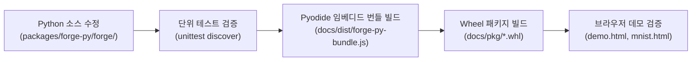
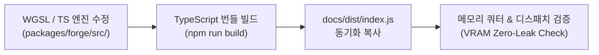
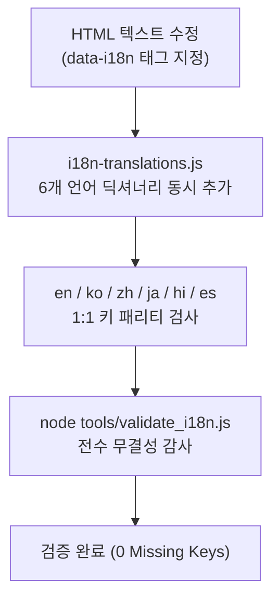

# AMEVA-Forge 소스코드 변경 및 유지보수 표준 매뉴얼 (Source Code Change Manual)

> **목적**: AMEVA-Forge 프로젝트의 소스코드(Python, TypeScript, WGSL, HTML/JS 문서)가 수정되거나 기능이 추가될 때, AI 에이전트와 개발자가 누락이나 불일치 없이 완벽한 정합성을 유지하며 대처하기 위한 표준 행동 지침입니다.

---

## 📌 1. 소스 변경 5대 불변 원칙 (Golden Rules)

1. **하드코딩 금지 및 i18n 6개 국어 동시 동기화**:
   - 문서나 데모 UI의 모든 텍스트는 HTML에 직접 하드코딩하지 않고 `data-i18n` 또는 `data-i18n-html`을 사용합니다.
   - 번역 키가 추가/변경될 경우 [`docs/i18n-translations.js`](file:///c:/Users/GAME/Desktop/uno-km/dev/ameva-forge/docs/i18n-translations.js)의 **6개 국어 (`en`, `ko`, `zh`, `ja`, `hi`, `es`) 전체에 1:1 패리티로 동시 반영**해야 합니다.
   - 변경 후 반드시 `node tools/validate_i18n.js`를 실행하여 무결성을 검증합니다.

2. **Jira 티켓 기반 엄격 추적 (Strict Tracking)**:
   - 사전에 정의된 Jira 티켓(`SCRUM-XX`) 없이 임의로 코드를 수정하지 않습니다.
   - '무엇을 수정했고, 왜 수정했는지, 어떤 검증 지표가 나왔는지'를 기록합니다.

3. **주석 및 문서화 무결성 (Documentation Integrity)**:
   - 모든 WGSL 셰이더, TypeScript 엔진, Python 프론트엔드 파일 상단 및 핵심 함수에는 `WHAT / WHY / HOW` 및 한글 메타데이터 주석을 필수로 유지합니다.

4. **WebGPU 버퍼 라이프사이클 및 메모리 쿼터 보호**:
   - 텐서 생성/해제 시 Weakref GC 파이널라이저와 Staging Buffer Pool 회수 로직이 어긋나지 않도록 Zero-Leak 원칙을 유지합니다.

5. **자동 빌드 아티팩트 동기화**:
   - Python 소스 변경 시 -> Wheel (`docs/pkg/`) 및 JS 인라인 번들 (`docs/dist/forge-py-bundle.js`) 동기화.
   - TypeScript/WGSL 소스 변경 시 -> 브라우저 배포 번들 (`docs/dist/index.js`) 동기화.

---

## 🔄 2. 레이어별 세부 변경 절차 (Change Workflow by Layer)

### [A] Python 프론트엔드 (`packages/forge-py/`) 변경 시



1. **코드 수정**: `packages/forge-py/forge/` 내부의 텐서, autograd, nn, functional, optim 코드 수정.
2. **단위 테스트 실행**:
   ```bash
   python -m unittest discover packages/forge-py/tests/
   ```
3. **Pyodide 가상 파일시스템 번들 갱신**:
   - 브라우저 데모(`demo.html`)에서 직접 로드하는 인라인 JS 번들을 갱신하여 GitHub/CDN 의존성 없이 로컬 오프라인 실행을 보장합니다.
4. **Wheel 빌드 및 배포 경로 복사**:
   - `docs/pkg/forge-0.1.0-py3-none-any.whl`로 최신 Wheel 배치.

---

### [B] TypeScript & WebGPU WGSL 백엔드 (`packages/forge/`) 변경 시



1. **코드 수정**: WGSL 셰이더 문자열, 디스패치 루프, WebGPU 파이프라인 캐시 수정.
   - *주의*: 2D 워크그룹 인덱스 계산(`workgroup_id.x + workgroup_id.y * 65535u`) 및 8D 스트라이드 브로드캐스팅 수식 보존 필수.
2. **빌드 및 docs 동기화**:
   - `packages/forge/dist/`의 번들 빌드 산출물을 `docs/dist/index.js`에 동기화.
3. **메모리 누수 검증**:
   - `demo.html` 또는 Playwright E2E를 통해 100회 반복 실행 시 VRAM 누수(UsedBytes 잔류) 0 바이트 확인.

---

### [C] 웹사이트 문서 및 UI (`docs/` HTML/JS/CSS) 변경 시 (i18n 다국어 프로토콜)



1. **HTML 파일 내 태그 지정**:
   - 일반 텍스트: `<h2 data-i18n="section.title">Default English</h2>`
   - HTML 태그 포함 텍스트: `<p data-i18n-html="section.desc"><strong>Default</strong> with <code>code</code></p>`
   - 플레이스홀더 / 툴팁: `<input data-i18n-placeholder="common.search" />`
2. **`docs/i18n-translations.js` 6개 언어 전수 등록**:
   - `en` (English), `ko` (한국어), `zh` (简体中文), `ja` (日本語), `hi` (हिन्दी), `es` (Español)
   - 6개 언어 객체 모두에 동일한 키 구조를 작성.
3. **전수조사 검증 스크립트 실행 (필수)**:
   ```bash
   node tools/validate_i18n.js
   node tools/test_i18n_runtime.js
   ```
   - 결과에 `ALL MULTILINGUAL AUDIT CHECKS PASSED`가 출력되어야만 완료로 인정.

---

## 📋 3. 변경 후 에이전트 셀프 체크리스트 (Agent Self-Checklist)

에이전트는 코드 수정 작업을 마친 후 사용자에게 보고하기 전에 다음 6개 항목을 자체 확인해야 합니다:

- [ ] **1. i18n 무결성**: `node tools/validate_i18n.js` 실행 결과 에러 0건인가?
- [ ] **2. 스토리지 영속성**: `node tools/test_i18n_runtime.js` 실행 결과 6개 언어 스토리지 전환 정상인가?
- [ ] **3. 빌드 번들 동기화**: 소스 수정 사항이 `docs/dist/` 및 `docs/pkg/`에 반영되었는가?
- [ ] **4. 주석 보존**: 기존 파일의 `WHAT / WHY / HOW` 및 한글 설명 주석이 유실되지 않았는가?
- [ ] **5. Jira 티켓 일치**: 수정 내역과 검증 수치가 해당 `SCRUM-XX` 작업 범위와 일치하는가?
- [ ] **6. Walkthrough 보고서**: 수정 파일 링크(`[filename](file:///...)`) 및 테스트 결과가 상세히 작성되었는가?
